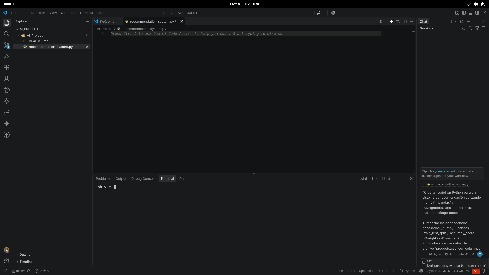

# AI_Project

# Actividad Formativa: Sistema de Recomendación con GitHub Copilot

## 1. Descripción del Proyecto
Este proyecto consiste en la creación de un sistema de recomendación básico en Python asistido por inteligencia artificial mediante GitHub Copilot, utilizando librerías como `pandas`, `numpy` y `scikit-learn` (`KNeighborsClassifier`).

---

## 2. Requisitos y Tecnologías
- Python 3.x
- Visual Studio Code
- Extensión GitHub Copilot
- Librerías: `numpy`, `pandas`, `scikit-learn`

---

## 3. Proceso Paso a Paso

### Paso 1: Configuración de la Cuenta y Repositorio en GitHub
- Solicitud de acceso a GitHub Copilot 
- Creación del repositorio remoto `AI_Project` en GitHub.


### Paso 2: Clonación Local y Entorno en Visual Studio Code
- Clonación del repositorio en el equipo local mediante el comando:
  ```bash
  git clone https://github.com/smokcard/AI_Project.git
  cd AI_Project

### Paso 3: Asistencia y Generación de Código con GitHub Copilot
Se utilizó GitHub Copilot (mediante comentarios o Copilot Chat) para formular la lógica del sistema:

Carga y preprocesamiento de variables (features y labels).

Partición del conjunto de datos en entrenamiento y prueba (train_test_split).

Entrenamiento del clasificador KNeighborsClassifier.

Evaluación del modelo con accuracy_score.

Definición de la función de recomendación (recommend).


### Paso 4: Ejecución y Resultados
Ejecución del script en la terminal para validar el porcentaje de precisión y la recomendación generada.

### paso 5: Control de Versiones con Git
Registro de cambios y sincronización con el repositorio remoto:

git status
git add .
git commit -m "Add recommendation system example"
git push -u origin main